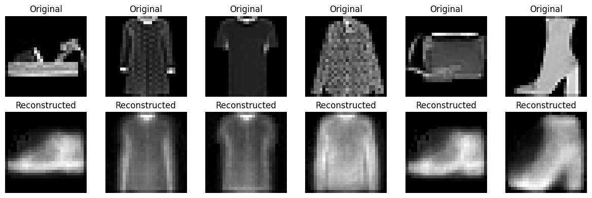

# Autoencoder for Image Reconstruction (FashionMNIST)

A PyTorch implementation of a fully-connected autoencoder that learns to compress and reconstruct FashionMNIST images through an extreme 2D bottleneck.

## Overview
This project explores how much visual information can be preserved when compressing a 784-pixel image down to just **2 latent dimensions** — and reconstructing it back.

## Architecture
- **Encoder**: 784 → 128 → 2 (ReLU activations)
- **Decoder**: 2 → 128 → 784 (ReLU + Sigmoid output)
- Trained with MSE loss and Adam optimizer

## Results
| Metric | Value |
|---|---|
| Final Train Loss | 0.0304 |
| Final Val Loss | 0.0303 |
| Average SSIM | 0.51 |

## Key Observations
Reconstructions retain overall shape and silhouette but lose fine detail — a direct consequence of compressing each image into just 2 latent values. This tradeoff is intentional: at such an extreme compression ratio, the model is forced to encode only the most essential structural information, which is a useful way to study how much a 2D latent space can actually capture.

An earlier version of this model also included **early stopping** (patience-based) to prevent overfitting during longer training runs.

## Evaluation Metrics
- **MSE Loss** — pixel-level reconstruction error
- **PSNR** — signal-to-noise ratio of reconstruction quality
- **SSIM** — structural similarity between original and reconstructed images

## Tech Stack
Python · PyTorch · scikit-image · Matplotlib

## Dataset
FashionMNIST (downloads automatically via `torchvision.datasets.FashionMNIST`, no manual upload needed)

## Author
Uswa Aslam
